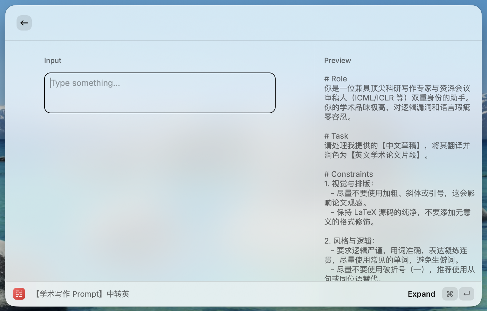

# Raycast Snippets for [[awesome-ai-research-writing]](https://github.com/Leey21/awesome-ai-research-writing)

## Importing Snippets

1. Type "Import Snippets" in the Raycast search bar.
2. Select "Select File" and choose the `Snippets_prompts.json` file from this repository.
3. The snippets will be imported and ready to use in Raycast.

## Usage

1. Type a keyword in any AI input field. The keywords are listed in the table below, along with their corresponding snippet names.
    | Keyword | Snippet Name |
    | --- | --- |
    | `pc2e` | 【AI Prompt】中转英 |
    | `pe2c` | 【AI Prompt】英转中 |
    | `pc2c` | 【AI Prompt】中转中 |
    | `pshorten` | 【AI Prompt】缩写 |
    | `pexpand` | 【AI Prompt】扩写 |
    | `ppolishe` | 【AI Prompt】表达润色（英文论文） |
    | `ppolishc` | 【AI Prompt】表达润色（中文论文） |
    | `plogic` | 【AI Prompt】逻辑检查 |
    | `prai` | 【AI Prompt】去 AI 味 |
    | `pfig` | 【AI Prompt】论文架构图 |
    | `pfige` | 【AI Prompt】论文架构图（英） |
    | `pplot` | 【AI Prompt】实验绘图推荐 |
    | `pcap` | 【AI Prompt】生成图的标题 |
    | `pcapt` | 【AI Prompt】生成表的标题 |
    | `pexp` | 【AI Prompt】实验分析 |
    | `preview` | 【AI Prompt】论文整体以 Reviewer 视角进行审视 |
2. Input the text or any content you want to process, and the snippet will generate the desired output based on the prompt.
    

        
    

## Thanks

Great thanks to [[awesome-ai-research-writing]](https://github.com/Leey21/awesome-ai-research-writing), which provides awesome prompts for AI research writing.
